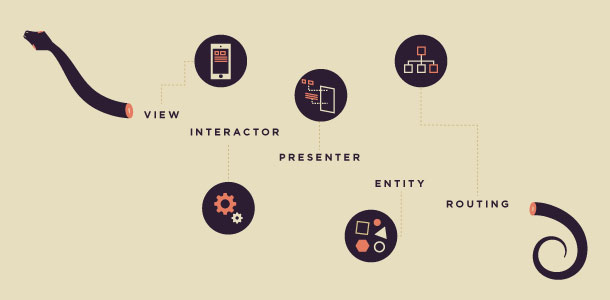

# Atlas Quantum Challenge

# Dagger 2 + Viper Architecture
This repository represents Atlas Quantum Challenge.

## Requirements
To run this project, you should have installed:
- Android studio
- Gradle

## Dagger 2.0 - Dependency injection
https://github.com/google/dagger

## Clean Architecture
[Uncle Bob - The Clean Architecture](https://blog.cleancoder.com/uncle-bob/2012/08/13/the-clean-architecture.html)

[Lyubomir Ganev - Clean Architecture for Android](https://luboganev.dev/blog/clean-architecture-pt1/)

## Viper Architecture
VIPER architecture is composed by Views, Interactors, Presenters, Entities and Routing.

## Reactive RXKotlin
I apply reactive concepts(Observers/ Observables and Operators) only for http request.

## Robolectric
http://robolectric.org/

I've been use Robolectric in my projects to do unit test which use Android elements.

## Espresso
https://developer.android.com/training/testing/espresso

Espresso provide an instrumented tests in my projects.

## Things to improve
I've been studying Koin vs Kodein which are libraries of dependency injection. For this moment, I decided to implement Dagger 2.

## Developed By
rodrigosimoesrosa@gmail.com